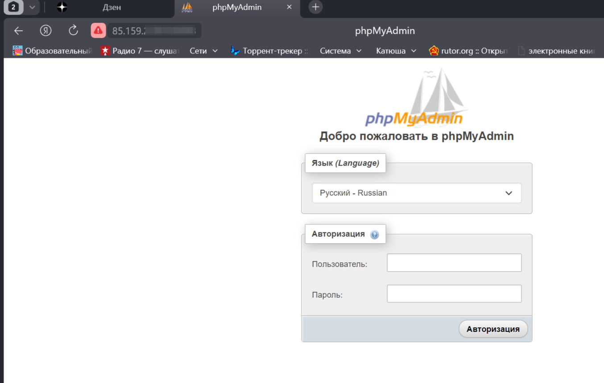

1. Создаём в хостовой машине папку для хранения базы данных. Полный путь к ней: /home/cotarius/db1

2. Запускаем контейнер mariadb с параметрами как на скриншоте: 

      *sudo docker run --name maria-db-container-1 -d -v /home/cotarius/db1:/var/lib/mysql -e MARIADB_ROOT_PASSWORD=test123 mariadb:10.10.2*

    и проверяем его работу командой:

    *docker ps*

    
3. Заходим в контейнер с помощью команды:

    *docker exec -it maria-db-container-1 bash*

    

    Командой *top* смотрим работающие процессы, включая процесс mysql

    

4. С помощью команды 

    *mysql -u root -p*

    входим в режим управления базой данных и вводим пароль, созданный выше (test123)

    

    Далее создаем базу данных db1, таблицу peoples и заполняем два поля таблицы

    

5. Выходим из базы данных и из контейнера mariadb и устанавливаем контейнер myphpadmin с линком на нашу базу данных:

    *sudo docker run --name myphpadmin-1 -d -p 8083:80 --link maria-db-container-1:db phpmyadmin/phpmyadmin*

    и проверяем работу докеров
    

6. Заходим в браузер, вводим ip address сервера с портом 8083 и видим результат проделанной работы
    
    

Студент Прокопенко Олег, группа 4336, урок №3

