# Руководство по установке Git

* скачать Git по ссылкам 
 [для Windows](https://git-scm.com/download/win), [для macOS](https://git-scm.com/download/mac), [для Linux/Unix](https://git-scm.com/download/linux) и установить.

 * скачать [VS Code](https://code.visualstudio.com/download) и установить.

 * В VS Code запустить терминал (CTRL + `) и прописать *git --version* (должна появиться надпись типа *git version 2.39.0*. Версия Git может отличаться)

    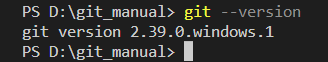

 * Нужно указать ваше имя и адрес электронной почты:
   
       git config --global user.enail "Ваш email"
       git config --global user.name "Ваше имя"

## Команды Git

* *git init* - инициализация репозитория Git
* *git add "somefile"* - добавить отдельный файл в область подготовленных данных
* *git add .* - добавить все файлы и папки в область подготовленных данных
* *git status* - просмотр статуса нужного репозитория

  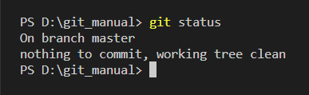
* *git commit -m "some changes"* - создание коммита в репозитории с сообщением об изменении

  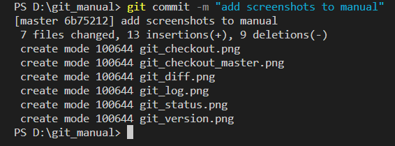
* *git log* - просмотр изменений, внесённых в репозиторий

  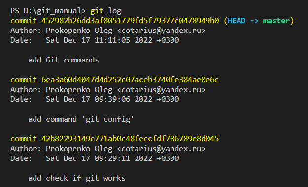

  *git log --all* - просмотр изменений, внесённых во все ветки репозитория

  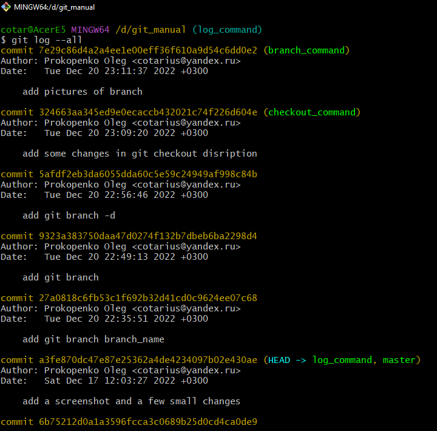

  *git log --graph --all* - просмотр изменений, внесённых во все ветки репозитория с добавлением графической составляющей

  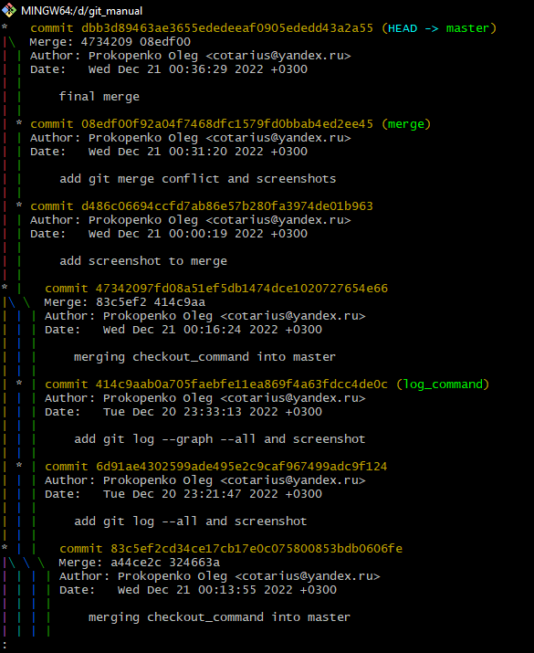

* *git diff "somefile"* - просмотр не подготовленных для фиксации изменений

  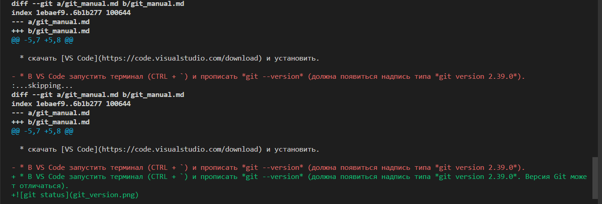

* *git checkout "имя контрольой точки"* - позволяет перемещаться между сохранёнными точками

  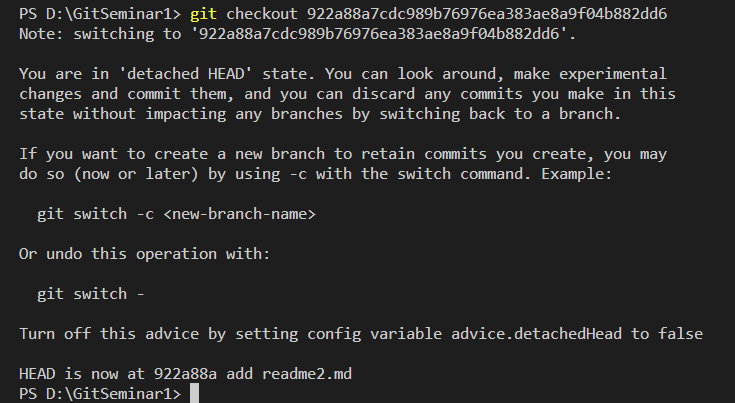

  *git checkout "название ветки"* - осуществляет переход между ветками

  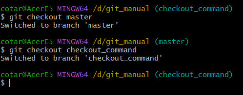

* *git branch "branch_name"* - создание новой ветки в репозитории.

  *git branch* - вывод на экран всех веток репозитория. Звёздочка (*) указывает в какой ветке мы находимся в данный момент

  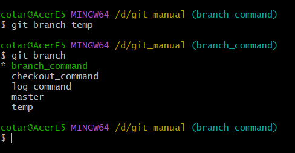

  *git branch - d "branch_name"* - удаляет ветку с именем branch_name

  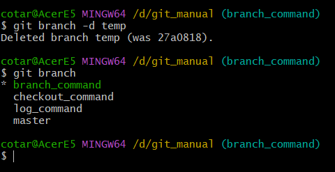

* *git merge "branch_name"* - происходит слияние ветки branch_name с **текущей** веткой.

  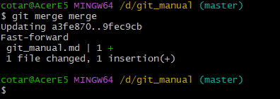

  Здесь мы влили ветку merge в ветку master

  Если при слиянии веток в одной и той же строке были разные изменения, то возникнет конфликт и git предложит его разрешить:

  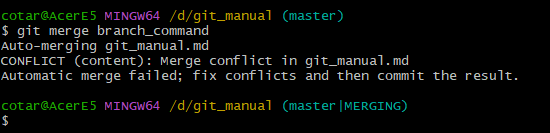
  
  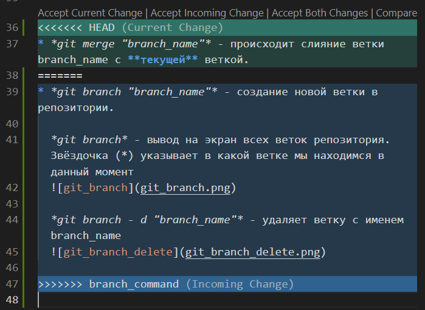
  Нужно будет вручную внести изменения: можно принять оба варианта текста (разместив их в нужном порядке), либо принять один из двух (удалив ненужный).
  После редактирования нужно будет ввести команду *git add*, далее *git commit*.

### Работа с удаленным репозиторием

Чтобы создать удалённый репозиторий нужно ввести команду 

_git remote add origin "URL-ссылка"_

где origin - это сокращенное имя удаленного репозитория, а URL-ссылка - это ссылка на ваш удаленный репозиторий.

_git remote -v_ - показывает путь к удаленному репозиторию

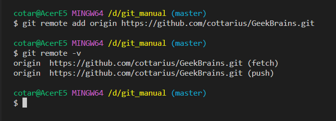

_git push -u origin --all_ - отправка локального репозитория в удаленный репозиторий origin.

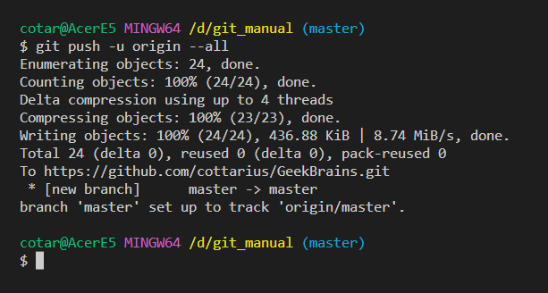

Вызвав команду _git log_, можно увидеть, что данные из локальной ветки master синхронизированы с удаленной веткой master нашего удаленного репозитория origin 

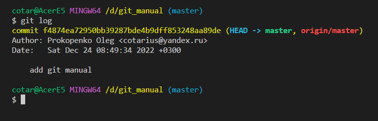

_git pull origin master_- заливаем данные с удаленного репозитория origin ветки master в локальный репозиторий

Если нужно внести изменения в чужой удаленный репозиторий, то необходимо выполнить следующие действия (на примере [Github.com](https://github.com)):

1. Переходим в чужой удаленный репозиторий на Github.
2. Нажимаем на Fork

    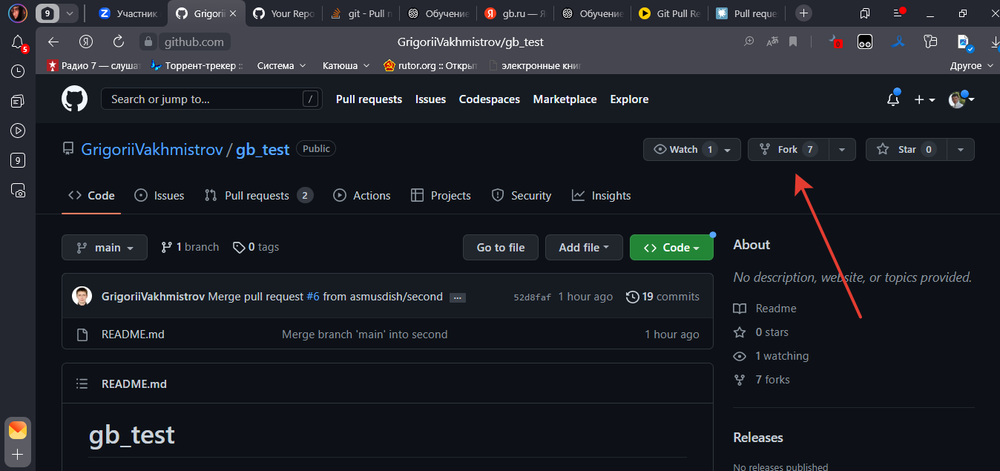

3. Далее github предложит создать у себя скопированный репозиторий с таким же именем

    

4. Создаем его, копируем путь в буфер обмена, переходим в VS Code и в терминале вводим команду **_git clone "адрес URL"_**

    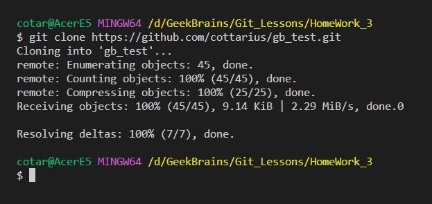

5. Далее, вносим свои изменения в проект, делаем commit и отправляем проект с свой удалённый репозиторий командой **_git push_**

    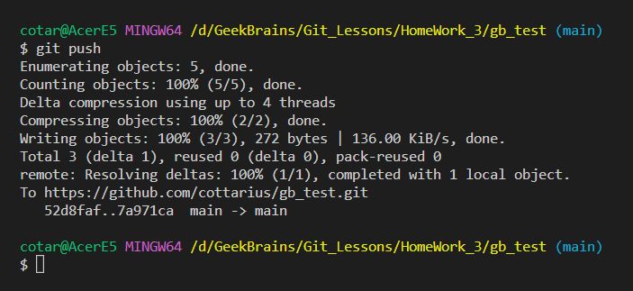

6. Переходим в Github, находим и нажимаем _Open pull request_

    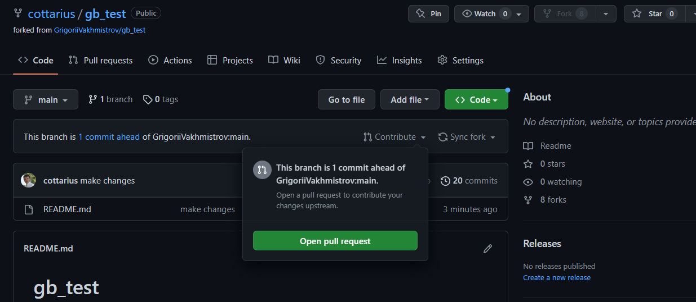

    и нажимаем _Create pull request_

    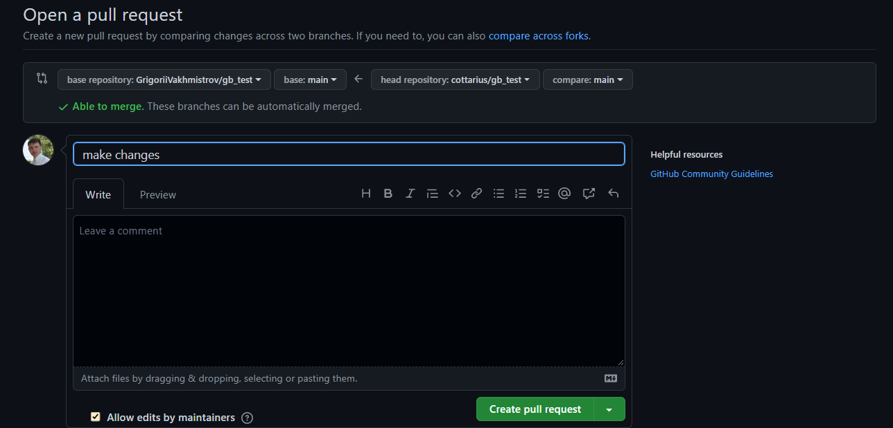

Далее ждём подтверждения слияния от хозяина репозитория
